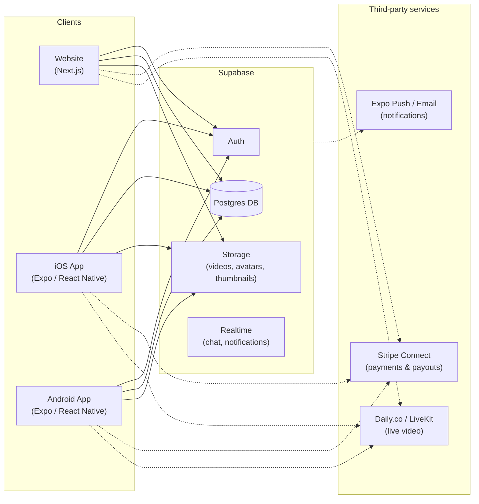

# Architecture

## Overview



Solid arrows are wired up in this prototype (via the Supabase client
libraries). Dashed arrows (Stripe, live video, push) are designed into the
data model and UI but not yet connected to a live account — see
[ROADMAP.md](ROADMAP.md).

## Why one shared backend

Both the website and the mobile app talk directly to the same Supabase
project — same Postgres database, same Auth users, same Storage buckets.
There's no separate custom API server to build and keep in sync; Supabase's
auto-generated REST/Realtime API plus row-level security (RLS) policies in
[`supabase/schema.sql`](../supabase/schema.sql) *is* the API layer. This
means a course uploaded from the mobile app shows up on the website
immediately, and vice versa, with no extra sync code.

## Monorepo layout

```
PeerScholar/
├── supabase/schema.sql      Single source of truth for the data model
├── packages/shared/         TypeScript types + constants used by both apps
│                             (subjects list, pricing tiers, status enums)
└── apps/
    ├── web/                  Next.js 14, App Router, Tailwind CSS
    │                         Renders the marketing site + full web app
    │                         (learner/tutor/QA/admin dashboards)
    └── mobile/                Expo (React Native), file-based screens
                              Learner + tutor experience, optimized for
                              on-the-go booking and watching courses
```

`packages/shared` keeps the two front ends from drifting apart: a `Course`
or `LiveSession` type is defined once and imported by both.

## Data model (see `supabase/schema.sql` for full DDL)

- `profiles` — one row per user (extends Supabase `auth.users`), holds
  `role` (student / tutor / qa_reviewer / admin), school email, age
  bracket, and parental consent status.
- `subjects` / `tutor_subjects` — subject taxonomy and what each tutor
  teaches.
- `courses` / `lessons` / `enrollments` — recorded courses and progress.
- `live_sessions` / `bookings` — scheduled live tutoring and who booked.
- `payments` — one row per transaction, tracks hold → release → payout.
- `reviews` — learner ratings/comments on tutors and courses.
- `qa_reviews` — QA reviewer rubric scores on courses and live sessions.
- `reports` — safety/quality reports on any user, session, or course.

Row-level security policies restrict, e.g., a learner to only read
`payments` rows where they're the payer, and a tutor to only edit their own
`courses`.

## Why Next.js for web, Expo for mobile

- **Next.js (App Router)** gives server-rendered pages for the public,
  SEO-relevant parts of the site (landing page, individual tutor/course
  pages — important for organic discovery) while still supporting fully
  interactive client-side dashboards.
- **Expo** builds one React Native codebase to both an iOS and an Android
  app (rather than writing Swift and Kotlin separately), which matters a
  lot for a small/solo team shipping to both stores.
- Both are TypeScript + React, so UI logic and mental models transfer
  between the two codebases even though they don't share components
  directly (web uses HTML/Tailwind, mobile uses React Native primitives).
