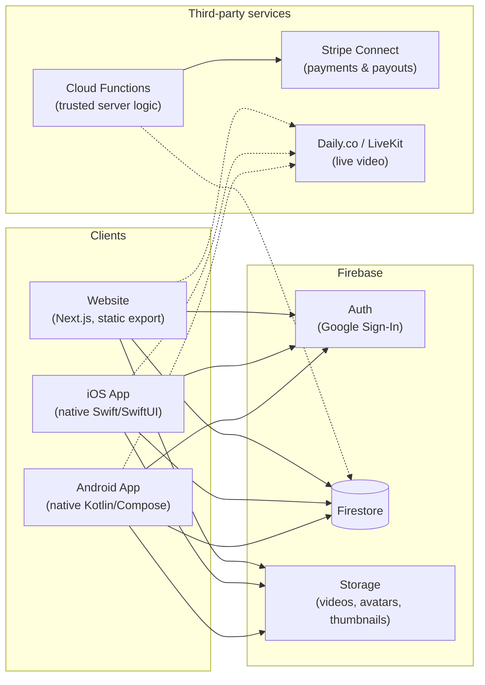

# Architecture

## Overview



Solid arrows are wired up in this prototype (via each platform's official
Firebase SDK, with real Google Sign-In). Dashed arrows (Stripe, live video)
are designed into the data model and UI but not yet connected to a live
account — see [ROADMAP.md](ROADMAP.md).

## Why three *native* front ends, one Firebase backend

The website, iOS app, and Android app are three separate, real codebases —
Next.js/TypeScript, Swift/SwiftUI, and Kotlin/Jetpack Compose — rather than
one cross-platform framework wrapping all three. Each talks directly to the
same Firebase project (same Auth users, same Firestore database, same
Storage buckets) via that platform's official Firebase SDK, so there's no
custom API server to build and keep in sync: Firebase Auth plus Firestore
security rules (in [`firebase/firestore.rules`](../firebase/firestore.rules))
*is* the API layer. A course uploaded from one client shows up on the
others immediately.

The trade-off, made deliberately: native code means writing (and keeping
in sync) three UI layers instead of one, but it means each app can use its
platform's real sign-in UX (Sign in with Google via iOS's native flow or
Android's Credential Manager, not an embedded web view), and there's no
framework/runtime layer between the UI and the OS.

## Monorepo layout

```
PeerScholar/
├── firebase/                Firestore security rules + indexes — single
│                             source of truth for what's allowed to read/write what
├── packages/shared/         TypeScript types + constants used by the website
│                             (subjects list, pricing tiers, status enums)
└── apps/
    ├── web/                  Next.js 14, static export, Tailwind CSS
    │                         Renders the marketing site + full web app
    │                         (learner/tutor/QA/admin dashboards), deployable
    │                         to GitHub Pages with no server required
    ├── ios/                   Native SwiftUI app. `project.yml` (XcodeGen) is
    │                         the source of truth for the Xcode project —
    │                         run `xcodegen generate` after editing it
    └── android/                Native Kotlin/Compose app, standard Gradle
                              project — open directly in Android Studio
```

iOS's `Models/` and Android's `model/` packages mirror
`packages/shared/src/types.ts` by hand (Swift and Kotlin can't import a
TypeScript package directly), so a `Course` or `LiveSession` shape is kept
identical across all three by convention — see
[FIRESTORE_SCHEMA.md](FIRESTORE_SCHEMA.md) for the canonical shape.

## Data model (see `docs/FIRESTORE_SCHEMA.md` for full detail)

- `profiles/{uid}` — one document per user, keyed by Firebase Auth UID, holds
  `role` (student / tutor / qa_reviewer / admin), age bracket, and parental
  consent status.
- `subjects/{id}` — subject taxonomy.
- `courses/{id}` (+ `lessons` subcollection) / `enrollments/{id}` —
  recorded courses and progress.
- `liveSessions/{id}` / `bookings/{id}` — scheduled live tutoring and who
  booked.
- `payments/{id}` — one document per transaction, written only by a Cloud
  Function once Stripe is wired up.
- `reviews/{id}` — learner ratings/comments.
- `qaReviews/{id}` — QA reviewer rubric scores.
- `reports/{id}` — safety/quality reports.

Firestore security rules restrict, e.g., a learner to only read `payments`
documents where they're the payer, and a tutor to only edit their own
`courses`.

## Why Next.js (static export) for web, native for mobile

- **Next.js** still gives fast, SEO-relevant pages for the public parts of
  the site (landing page, individual tutor/course pages), but is built as a
  **static export** here — no Node server required — so it can be hosted
  for free on GitHub Pages. Firebase's client SDKs work the same in a
  static site as a server-rendered one, since all auth/data access happens
  in the browser.
- **Native Swift and Kotlin** were chosen over Expo/React Native for the
  mobile apps because the ask was for genuinely native projects — each
  opens directly in Xcode / Android Studio, uses each platform's real
  navigation and sign-in primitives, and has no JavaScript bridge or
  Metro/Expo runtime layer.
